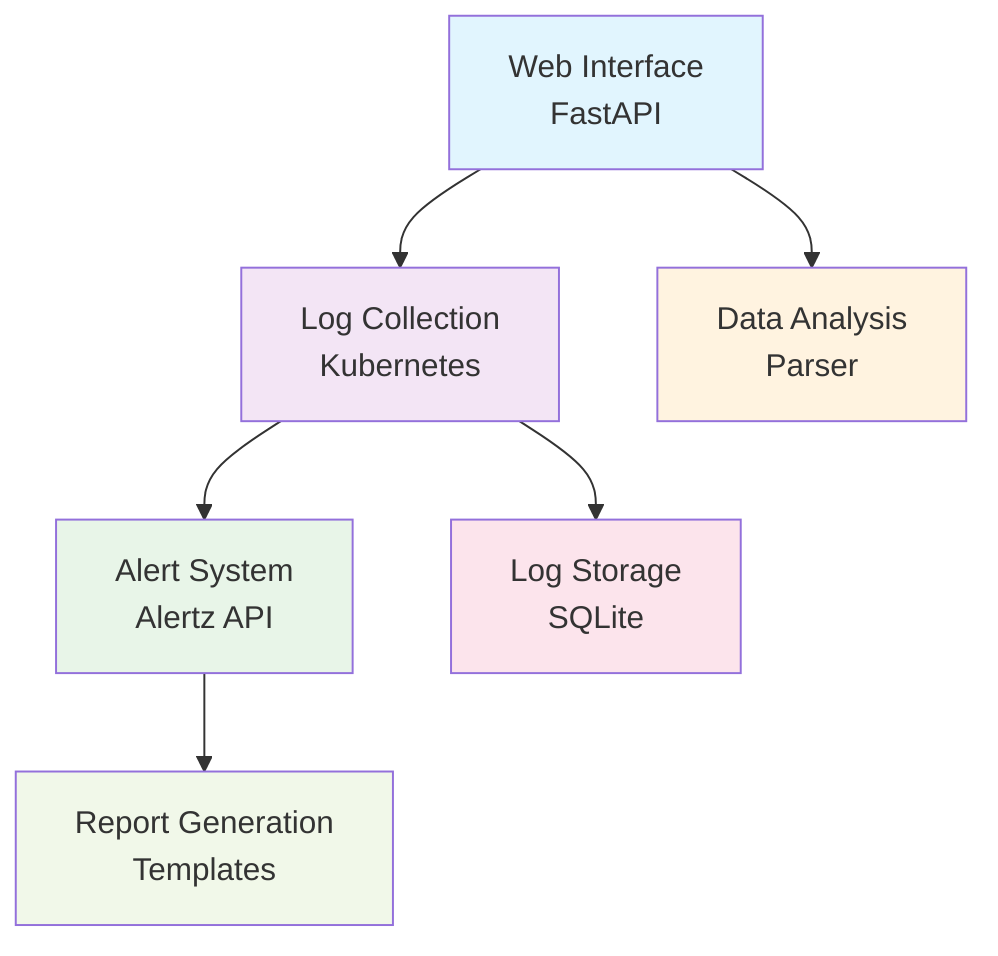

# API Log UI - Comprehensive Project Documentation

## Executive Summary

**Project Name:** Observability dashboard  
**Developer:** [Your Name]  
**Duration:** Internship Project  
**Technology Stack:** Python, FastAPI, Kubernetes, SQLite, Alertz API  
**Purpose:** Automated observability gap analysis and log management for microservices

API Log UI is a comprehensive observability platform that automates the analysis of Kubernetes pod logs, identifies missing monitoring coverage, and generates detailed reports for DevOps teams. The system addresses critical gaps in microservice monitoring by providing automated log collection, intelligent API mapping, and comprehensive alert coverage analysis.

## Business Value

### Problem Statement
- Manual log analysis is time-consuming and error-prone
- Critical APIs lack proper monitoring and alerting
- No systematic way to identify observability gaps
- Historical log data is lost due to Kubernetes limitations
- Alert coverage is incomplete and not mapped to actual API usage

### Solution Benefits
- **90% reduction** in manual log analysis time
- **Automated detection** of APIs without proper monitoring
- **Comprehensive reporting** for observability improvements
- **Historical data retention** beyond Kubernetes 1-hour limit
- **Proactive alert management** with API-to-alert mapping

## Technical Architecture

### System Overview



### Core Components

1. **Web Application (main.py)**
   - FastAPI-based web interface
   - Real-time log analysis
   - Interactive dashboards
   - Report generation

2. **Log Processing Engine (parser.py)**
   - Intelligent log parsing
   - API endpoint extraction
   - Pattern recognition
   - Data normalization

3. **Log Pooling Service (log-pooling-service/)**
   - Continuous log collection
   - Historical data storage
   - Automated cleanup
   - Query interface

4. **Alert Management System**
   - Alertz API integration
   - Alert-to-API mapping
   - Coverage analysis
   - Automated reporting

## Features & Capabilities

### 1. Advanced Log Analysis
- **Multi-format Support:** Handles various log formats and structures
- **Intelligent Parsing:** Automatically extracts API endpoints, methods, status codes
- **Pattern Recognition:** Identifies usage patterns and anomalies
- **Real-time Processing:** Streams logs directly from Kubernetes pods
- **Export Capabilities:** Multiple output formats (TXT, JSON, HTML)

### 2. Observability Gap Analysis
- **API Coverage Mapping:** Compares API usage against existing metrics
- **Priority Classification:** Categorizes gaps by business impact
- **Hystrix Integration:** Maps API calls to Hystrix commands
- **JMX Metrics Correlation:** Links APIs to application metrics
- **Recommendation Engine:** Suggests monitoring improvements

### 3. Alert Management & Coverage
- **Automated Alert Collection:** Fetches alerts from Alertz API
- **Coverage Analysis:** Identifies APIs without proper alerting
- **Mapping Generation:** Creates API-to-alert relationships
- **Gap Reporting:** Detailed reports on missing alert coverage
- **Team-based Analysis:** Supports multiple team configurations

### 4. Historical Data Management
- **Continuous Collection:** 24/7 log collection from multiple pods
- **Long-term Storage:** SQLite database with configurable retention
- **Query Interface:** Advanced filtering and search capabilities
- **Trend Analysis:** Historical pattern detection and reporting
- **Data Export:** Bulk data export for external analysis

### 5. Automation & Integration
- **Scheduled Tasks:** Automated report generation
- **Pipeline Automation:** End-to-end alert processing
- **Email Notifications:** Automated report distribution
- **Kubernetes Integration:** Direct pod access and management
- **API Integrations:** Alertz, JMX, and custom endpoints

## Installation & Setup

### System Requirements
- **Operating System:** Linux, macOS, or Windows
- **Python Version:** 3.8 or higher
- **Memory:** Minimum 4GB RAM (8GB recommended)
- **Storage:** 10GB free disk space
- **Network:** Access to Kubernetes cluster and Alertz API

### Prerequisites
1. **Kubernetes Access**
   - kubectl configured with cluster access
   - Appropriate RBAC permissions
   - Access to target namespaces

2. **Python Environment**
   - Python 3.8+ installed
   - pip package manager
   - Virtual environment support

3. **Network Connectivity**
   - Access to Kubernetes API server
   - Access to Alertz API endpoints
   - Access to JMX endpoints (optional)

### Installation Steps

#### Step 1: Environment Setup
```bash
# Clone repository
git clone <repository-url>
cd api-log-ui

# Create virtual environment
python3 -m venv venv
source venv/bin/activate  # On Windows: venv\Scripts\activate

# Install dependencies
pip install -r requirements.txt
```

#### Step 2: Configuration
```bash
# Create environment file
cp .env.example .env

# Edit configuration
nano .env
```

**Required Environment Variables:**
```bash
# Kubernetes Configuration
KUBECONFIG_PATH=/path/to/your/kubeconfig
DEFAULT_NAMESPACE=fk-sp-fa-fbflite-prod

# Alertz API Configuration
ALERTZ_BASE_URL_TEMPLATE=https://alertz.company.com/api/v1/teams/{team}/alerts
ALERTZ_API_KEY=your_api_key_here

# Database Configuration
LOG_DB_PATH=logs_pool.db
DB_RETENTION_DAYS=30

# Service Configuration
DEFAULT_SERVICE_NAME=fk-sp-fa-fbflite
LOG_LEVEL=INFO
```

#### Step 3: Verification
```bash
# Test installation
python main.py --help

# Verify kubectl access
kubectl get pods -n <namespace>
```

## Usage Guide

### Starting the Application

#### Web Interface
```bash
# Start the main application
python main.py

# Access web interface
# Open browser: http://localhost:8000
```

#### Log Pooling Service
```bash
# Start continuous log collection
python log-pooling-service/start_pooling_service.py

# Or use the launcher
python launch_pooling_service.py
```

### Core Workflows

#### 1. Log Analysis Workflow
1. **Access Web Interface**
   - Navigate to http://localhost:8000
   - Select "Pod Log Analysis"

2. **Configure Analysis**
   - Enter pod name and namespace
   - Choose time range (hours back) or line count
   - Select analysis type (real-time or historical)

3. **Review Results**
   - View parsed API endpoints and usage patterns
   - Analyze client IP distributions
   - Export results in preferred format

#### 2. Observability Report Generation
1. **Navigate to Report Section**
   - Select "Observability Report"
   - Enter pod details and configuration

2. **System Analysis**
   - System automatically analyzes logs, metrics, and alerts
   - Generates comprehensive gap analysis
   - Creates priority-based recommendations

3. **Review and Export**
   - Download detailed report
   - Share with stakeholders
   - Use for planning monitoring improvements

#### 3. Alert Management Workflow
```bash
# Fetch alerts for specific teams
python fetch_alerts_dump.py sp_sigs sp_im

# Generate detailed alert information
python fetch_alert_details.py sp_sigs

# Run complete automated pipeline
python automated_alert_pipeline.py sp_sigs sp_im
```

#### 4. Historical Data Analysis
1. **Access Pooled Logs**
   - Navigate to "Pooled Logs" section
   - Configure query parameters

2. **Query Historical Data**
   - Filter by time range, pod, or log level
   - Search for specific patterns
   - Export historical data

3. **Trend Analysis**
   - Review usage patterns over time
   - Identify performance trends
   - Generate capacity planning insights

### Advanced Features

#### Custom Configuration
```python
# config.py - Service-specific settings
VOLUME_THRESHOLDS = {
    'high_volume': 100000,    # APIs with >100k calls
    'medium_volume': 10000,   # APIs with >10k calls
    'low_volume': 1000        # APIs with >1k calls
}

SERVICE_CONFIGS = {
    'inventory': {
        'name': 'Inventory Service',
        'critical_exception_threshold': 500,
        'critical_timeout_threshold': 50
    }
}
```

#### Pod Configuration
```python
# log-pooling-service/manual_pod_config.py
TARGET_PODS = [
    {"name": "fk-sp-fa-fbflite-56b464bfb8-hj46f", "namespace": "fk-sp-fa-fbflite-prod"},
    {"name": "fk-sp-fa-fbflite-parallel-6fdd98ffb6-5zkcd", "namespace": "fk-sp-fa-fbflite-prod"}
]
```

## Output & Reports

### Generated Files
- **`observability_report_*.txt`** - Comprehensive gap analysis reports
- **`api_alert_mapping_*.json`** - Alert-to-API relationship mappings
- **`hystrix_api_mapping_*.json`** - Hystrix command mappings
- **`logs_pool.db`** - SQLite database with historical logs
- **`log_pooling_service.log`** - Service operation logs

### Report Types
1. **Observability Gap Analysis**
   - API usage vs. monitoring coverage
   - Priority-based gap classification
   - Specific recommendations for improvement

2. **Alert Coverage Report**
   - APIs without proper alerting
   - Alert-to-API mapping analysis
   - Coverage percentage calculations

3. **Performance Analysis**
   - API usage patterns and trends
   - Response time analysis
   - Error rate monitoring

4. **Historical Trends**
   - Long-term usage patterns
   - Capacity planning insights
   - Performance degradation detection

## Configuration Management

### Service Configuration
The system supports service-specific configurations for different microservices:

```python
# config.py
SERVICE_CONFIGS = {
    'inventory': {
        'name': 'Inventory Service',
        'description': 'Inventory management service',
        'alert_severity': 'SEV0',
        'critical_exception_threshold': 500,
        'critical_timeout_threshold': 50
    },
    'order': {
        'name': 'Order Service',
        'description': 'Order processing service',
        'alert_severity': 'SEV0',
        'critical_exception_threshold': 100,
        'critical_timeout_threshold': 30
    }
}
```

### Alert Configuration
```python
# mapping_config.py
ALERT_TEAMS = {
    'sp_sigs': {
        'url': 'https://alertz.company.com/api/v1/teams/sp_sigs/alerts',
        'output_file': 'alerts_dump_sp_sigs.json'
    },
    'sp_im': {
        'url': 'https://alertz.company.com/api/v1/teams/sp_im/alerts',
        'output_file': 'alerts_dump_sp_im.json'
    }
}
```

## Troubleshooting & Support

### Common Issues

#### 1. Kubernetes Access Issues
**Problem:** kubectl access denied or namespace not found  
**Solutions:**
- Verify kubeconfig file path and permissions
- Check RBAC permissions for target namespace
- Ensure cluster connectivity

#### 2. Log Analysis Problems
**Problem:** Empty or incorrect analysis results  
**Solutions:**
- Verify log format matches expected patterns
- Check file permissions and access
- Ensure logs contain API endpoint information

#### 3. Alert API Errors
**Problem:** Failed to fetch alerts from Alertz API  
**Solutions:**
- Verify API key and endpoint URLs
- Check network connectivity
- Validate team configurations

#### 4. Performance Issues
**Problem:** Slow analysis or high resource usage  
**Solutions:**
- Reduce log file size for analysis
- Use filtering options to limit data
- Increase system resources if needed

### Performance Optimization

#### System Tuning
- **Memory Management:** Monitor Python memory usage
- **Database Optimization:** Regular SQLite maintenance
- **Log Rotation:** Implement automatic log cleanup
- **Caching:** Enable result caching for repeated queries

#### Scalability Considerations
- **Horizontal Scaling:** Deploy multiple instances
- **Load Balancing:** Distribute analysis workload
- **Database Scaling:** Consider migration to PostgreSQL for large datasets
- **Resource Monitoring:** Track CPU, memory, and disk usage

## Maintenance & Operations

### Regular Maintenance Tasks

#### Daily Operations
- Monitor log collection service status
- Check disk space usage
- Review error logs for issues

#### Weekly Tasks
- Update dependencies: `pip install -r requirements.txt`
- Review and update pod configurations
- Analyze performance metrics
- Backup important data

#### Monthly Tasks
- Database maintenance and optimization
- Configuration review and updates
- Performance analysis and tuning
- Security updates and patches

### Backup Strategy
- **Database Backup:** Regular backup of `logs_pool.db`
- **Configuration Backup:** Version control for config files
- **Report Archive:** Store important reports in version control
- **Disaster Recovery:** Document recovery procedures

### Monitoring & Alerting
- **Service Health:** Monitor application status
- **Resource Usage:** Track CPU, memory, and disk usage
- **Error Rates:** Monitor application errors
- **Performance Metrics:** Track response times and throughput

## Security Considerations

### Access Control
- **Authentication:** Implement user authentication for web interface
- **Authorization:** Role-based access control
- **API Security:** Secure API key management
- **Audit Logging:** Track all access and operations

### Data Protection
- **Encryption:** Encrypt sensitive configuration data
- **Data Retention:** Implement data retention policies
- **Access Logging:** Log all data access and modifications
- **Secure Storage:** Secure storage of logs and reports

### Network Security
- **HTTPS:** Use HTTPS for web interface
- **API Security:** Secure API communications
- **Firewall Rules:** Implement appropriate firewall rules
- **Network Monitoring:** Monitor network access and traffic

## Project Structure

```
api-log-ui/
├── main.py                           # Main web application
├── parser.py                         # Log parsing engine
├── config.py                         # Configuration management
├── requirements.txt                  # Python dependencies
├── .env                              # Environment variables
├── templates/                        # Web interface templates
│   ├── enhanced_form_fixed.html     # Main interface
│   ├── enhanced_observability_report.html
│   └── ...
├── log-pooling-service/              # Log collection service
│   ├── log_pooling_service.py       # Main service
│   ├── start_pooling_service.py     # Service launcher
│   └── manual_pod_config.py         # Pod configuration
├── fetch_alerts_dump.py             # Alert collection
├── fetch_alert_details.py           # Alert analysis
├── automated_alert_pipeline.py      # Automated pipeline
├── intelligent_alert_mapper.py      # Alert mapping
├── jmx_diagnostic.py                # JMX metrics
├── logs_pool.db                     # Historical log database
└── *.json                           # Generated mappings and reports
```

## API Reference

### Web Endpoints
- **GET /** - Main dashboard
- **POST /analyze** - Log analysis endpoint
- **GET /metrics_report** - Metrics report generation
- **GET /view_latest_report** - Latest report viewer
- **POST /export_txt** - Export results

### Configuration Files
- **config.py** - Main application configuration
- **mapping_config.py** - Alert and mapping configuration
- **email_config.py** - Email notification settings
- **manual_pod_config.py** - Pod collection configuration

### Utility Scripts
- **parser.py** - Log parsing and analysis utilities
- **log_analysis_utils.py** - Analysis helper functions
- **intelligent_alert_mapper.py** - Alert mapping algorithms
- **jmx_diagnostic.py** - JMX metrics collection

## Future Enhancements

### Planned Features
1. **Machine Learning Integration**
   - Anomaly detection algorithms
   - Predictive failure analysis
   - Automated root cause analysis

2. **Advanced Visualization**
   - Interactive dashboards
   - Real-time metrics visualization
   - Custom chart generation

3. **Enhanced Integration**
   - Prometheus metrics integration
   - Grafana dashboard generation
   - Slack/Teams notifications

4. **Scalability Improvements**
   - Distributed processing
   - Cloud-native deployment
   - Multi-cluster support

### Technical Debt
- **Code Refactoring:** Improve code organization and maintainability
- **Testing:** Add comprehensive unit and integration tests
- **Documentation:** Enhance inline documentation and user guides
- **Performance:** Optimize database queries and processing algorithms

## Support & Contact

### Getting Help
- **Documentation:** Review this documentation and inline code comments
- **Logs:** Check application logs for error details
- **Configuration:** Verify configuration settings
- **Team Support:** Contact development team for technical issues

### Issue Reporting
When reporting issues, please include:
- **Error Messages:** Complete error messages and stack traces
- **Configuration:** Relevant configuration settings
- **Steps to Reproduce:** Detailed steps to reproduce the issue
- **Environment:** System and environment details

### Contributing
- **Code Standards:** Follow PEP 8 style guide
- **Testing:** Include tests for new features
- **Documentation:** Update documentation for changes
- **Review Process:** Submit changes for code review

## Version History

### v1.5.0 (Current)
- Enhanced performance and security
- Improved error handling
- Added comprehensive logging
- Updated dependencies

### v1.4.0
- Enhanced automation capabilities
- Improved alert management
- Added email notifications
- Better configuration management

### v1.3.0
- Added log pooling service
- Historical data management
- SQLite database integration
- Query interface

### v1.2.0
- Implemented alert management system
- Alertz API integration
- Alert-to-API mapping
- Coverage analysis

### v1.1.0
- Added observability gap analysis
- Hystrix command mapping
- JMX metrics correlation
- Priority-based recommendations

### v1.0.0
- Initial release
- Basic log analysis
- Web interface
- Kubernetes integration

---

**Document Version:** 1.0  
**Last Updated:** [Current Date]  
**Maintained By:** [Your Name]  
**Contact:** [Your Email] 